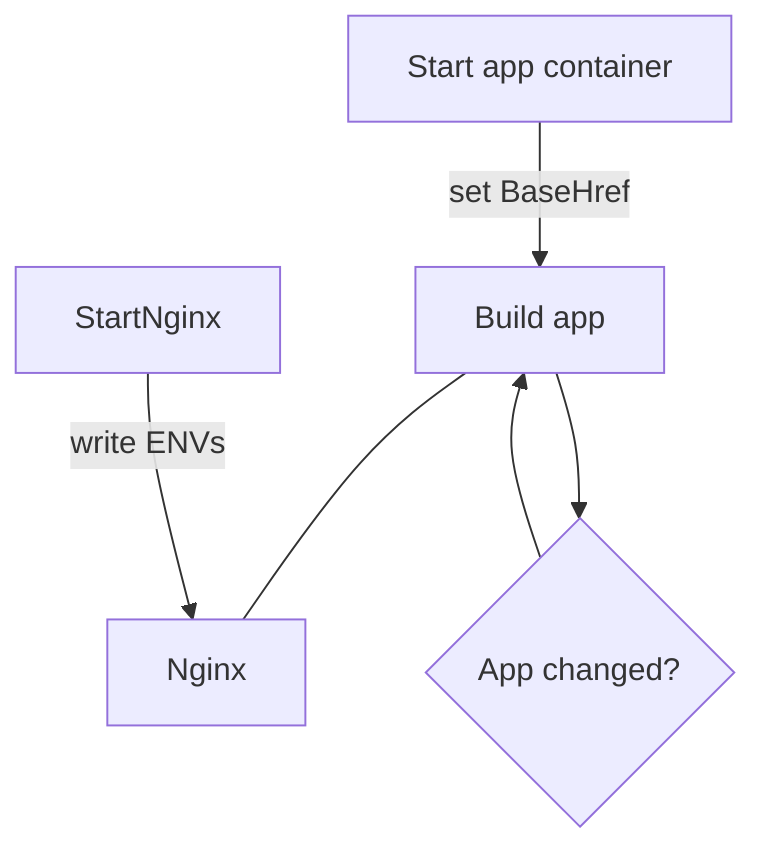
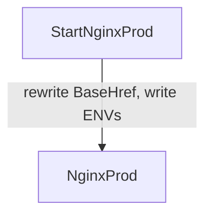

# Workflow

Note: to view the following diagrams, you'll need [Mermaid](https://mermaidjs.github.io/).
You can also just copy the following code into the 
    [Mermaid live editor](https://mermaidjs.github.io/mermaid-live-editor/).

Dev

Prod

